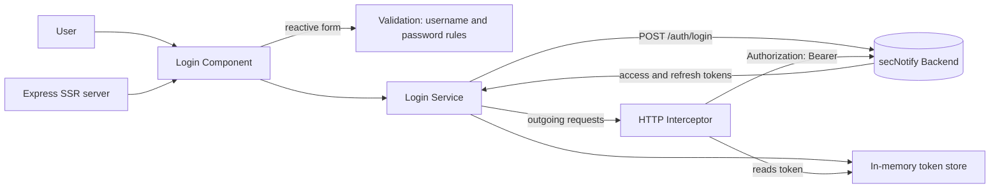

<div align="center">

# secNotify-FEnd


-000000)


**Angular 18 frontend web client for the secNotify secure notification platform, featuring server-side rendering, a reactive login form, and a Bearer-token HTTP interceptor.**

<!-- TODO: screenshot/GIF - capture the login form with validation messages showing -->

</div>

> [!NOTE]
> This project is in early development. The only feature built so far is the
> login screen: a reactive form with client-side validation, a service that
> posts credentials to the backend, and a global HTTP interceptor that attaches
> the access token to outgoing requests. Everything beyond login (the dashboard,
> notification views, route guards, token refresh wiring) is planned but not yet
> built. The sections below document only what is actually in the code on this
> branch.

## Table of Contents

- [About](#about)
- [Features](#features)
- [Tech Stack](#tech-stack)
- [Architecture](#architecture)
- [Getting Started](#getting-started)
- [Project Structure](#project-structure)
- [Configuration](#configuration)
- [Roadmap](#roadmap)
- [Contributing](#contributing)
- [License](#license)

## About

`secNotify-FEnd` is the web client for the secNotify secure notification
platform. It is built with Angular 18 and runs with server-side rendering (SSR)
through an Express server, so the first page is rendered on the server and then
hydrated in the browser.

The current code focuses on getting authentication right. A user lands on the
login page, fills in a reactive form that validates the username and password,
and submits. The login service sends the credentials to the backend auth
endpoint and keeps the returned tokens in memory. A functional HTTP interceptor
then adds the access token as a `Bearer` header to every outgoing request, which
is the foundation for calling protected endpoints later.

The Angular app lives in the `secureNotifyFront/` subfolder of this repository,
so run all commands from inside that folder.

## Features

- Reactive login form built with Angular Reactive Forms (`FormGroup` and `FormControl`).
- Client-side validation: username minimum length, plus password rules for length, uppercase, lowercase, number, and symbol.
- Login service that posts credentials to `POST /auth/login` and stores the access token, refresh token, and user in memory.
- Functional HTTP interceptor that attaches `Authorization: Bearer <token>` and JSON content-type headers to outgoing requests.
- Server-side rendering with an Express server (`@angular/ssr`) and client hydration.
- Typed request and response interfaces for the login flow.
- Standalone-component setup using Angular's `provideRouter` and `provideHttpClient`.

## Tech Stack

| Layer | Technology |
|-------|-----------|
| Framework | Angular 18.2 (standalone components) |
| Language | TypeScript 5.5 |
| Forms | Angular Reactive Forms |
| HTTP | `@angular/common/http` with functional interceptors |
| Reactivity | RxJS 7.8 |
| Rendering | Angular SSR (`@angular/ssr`) on Express 4 |
| Tooling | Angular CLI 18.2 |
| Testing | Karma and Jasmine |

## Architecture



## Getting Started

### Prerequisites

```bash
node --version   # Node.js 18.x or newer
npm --version
```

### Installation

```bash
git clone https://github.com/atiqbitstream/secNotify-FEnd.git
cd secNotify-FEnd/secureNotifyFront
npm install
```

### Run the development server

```bash
npm start
```

This runs `ng serve`. Open `http://localhost:4200/` in your browser. The app
reloads automatically when you change source files.

### Build

```bash
npm run build
```

Build artifacts are written to `dist/secure-notify-front/`.

### Run the SSR server

```bash
npm run build
npm run serve:ssr:secureNotifyFront
```

### Run unit tests

```bash
npm test
```

## Project Structure

```text
secureNotifyFront/
├── src/
│   ├── app/
│   │   ├── features/
│   │   │   └── login/
│   │   │       ├── interfaces/        # loginRequest and loginResponse types
│   │   │       ├── services/          # login.service.ts (auth calls, token store)
│   │   │       ├── login.component.*  # reactive login form (ts, html, css)
│   │   │       ├── login.module.ts
│   │   │       └── login-routing.module.ts
│   │   ├── app.component.*            # root component
│   │   ├── app.config.ts             # providers: router, http, interceptor
│   │   ├── app.config.server.ts      # SSR config
│   │   └── app.routes.ts             # routes ('' -> LoginComponent)
│   ├── Interceptors/
│   │   └── login.interceptor.ts      # attaches Bearer token to requests
│   ├── environments/
│   │   └── environment.ts            # apiUrl base
│   ├── main.ts                       # browser bootstrap
│   ├── main.server.ts                # server bootstrap
│   └── index.html
├── server.ts                         # Express SSR entry
├── angular.json
└── package.json
```

## Configuration

The API base URL is set in `secureNotifyFront/src/environments/environment.ts`.
There are no committed secrets; this file only holds a local development URL.

| Variable | Description | Default |
|----------|-------------|---------|
| `apiUrl` | Base URL of the secNotify backend API | `http://localhost:3000` |
| `production` | Production mode flag | `false` |

The login service calls `${apiUrl}/auth/login`, so point `apiUrl` at your running
backend before testing the login flow.

## Roadmap

- [x] Login page with reactive form and validation
- [x] Login service that posts credentials and stores tokens
- [x] HTTP interceptor that attaches the Bearer token
- [x] Server-side rendering with Express
- [ ] Persist tokens across reloads (currently in-memory only)
- [ ] Redirect to a dashboard after a successful login
- [ ] Route guards for protected pages
- [ ] Notification list and detail views
- [ ] Refresh-token flow on expiry
- [ ] Logout
- [ ] Production environment file and API URL handling
- [ ] Unit and end-to-end test coverage

## Contributing

Contributions are welcome. Open an issue to discuss a change, then send a pull
request against the `dev` branch.

## License

Distributed under the MIT License. See [LICENSE](LICENSE).
